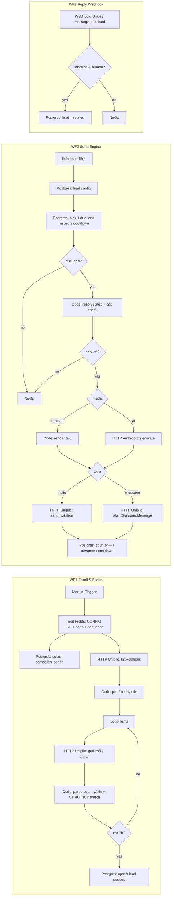

# LinkedIn Campaign Engine — n8n Blueprint

A faithful n8n re-build of this app's campaign logic. Same "good logic":
**ICP match → enrich → strict re‑match → send within daily caps, one per account
per cooldown → timed follow‑ups → stop on reply.** You configure everything in one
**Edit Fields (Set)** node at the start — ICP, caps, cadence, and the message
sequence.

It uses Unipile for LinkedIn and (optionally) Anthropic for AI‑written messages,
exactly like the app. State lives in Postgres (you can point it at the same Neon DB
this app uses, or a fresh one).

---

## Architecture — 3 workflows + 1 datastore

| Workflow | Trigger | Job |
|---|---|---|
| **WF1 · Enroll & Enrich** | Manual / Schedule | Save your config, pull the network, ICP‑filter, enrich, strict‑match, insert `leads` (state `queued`). |
| **WF2 · Send Engine** | Schedule (every 15 min) | Pick one *due* lead, gate on daily caps + account cooldown, write the message (template or AI), send invite/DM via Unipile, advance the step & schedule the next follow‑up. |
| **WF3 · Reply Webhook** | Unipile webhook | Inbound human reply → set lead `replied` (stops the sequence). Optional: AI classify + draft. |

Why 3 workflows: the same split the app uses — enrollment, a paced cron sender, and
an event webhook. It keeps each concern isolated and lets the sender self‑pace.



---

## The CONFIG node (Edit Fields) — where you set the ICP & everything

WF1 starts with an **Edit Fields (Set)** node named **CONFIG**. Everything you tune
lives here; WF1 writes it to `campaign_config` so WF2/WF3 read the same source.

```jsonc
{
  "account_id": "UNIPILE_ACCOUNT_ID",           // the connected LinkedIn account
  "icp": {
    "title_keywords": ["VP Marketing", "Demand Gen", "Head of Growth"],
    "countries":      ["US", "GB", "CA"],         // ISO‑2, matched on real profile location
    "tags":           []                          // optional
  },
  "caps": { "invites_per_day": 25, "messages_per_day": 40 },
  "cooldown": { "min_sec": 120, "max_sec": 600 },  // one send per account per random gap
  "voice": "You are a senior B2B leader writing first-person LinkedIn DMs. Short, no fluff, no emojis, one question, never pitch early.",
  "sequence": [
    { "type": "invite",  "mode": "ai",       "delay_hours": 0,  "prompt": "Invite note, <300 chars, one genuine reason to connect based on their role/company. No pitch." },
    { "type": "message", "mode": "ai",       "delay_hours": 24, "prompt": "Welcome. Warm thank-you + one relevant observation. No pitch, no ask, no link." },
    { "type": "message", "mode": "ai",       "delay_hours": 72, "prompt": "One sharp insight for their role + a single open question." },
    { "type": "message", "mode": "template", "delay_hours": 96, "text": "Hi {{first_name}}, sharing this in case it helps: https://yoursite.com/blog/x" }
  ]
}
```

- `type`: `invite` (counts against **invites/day**) or `message` (counts against **messages/day**).
- `mode`: `template` (uses `text`, `{{first_name}}` etc.) or `ai` (Anthropic writes it from `voice` + `prompt` + the profile).
- `delay_hours`: wait after the previous step (or after acceptance) before this step fires.

---

## Datastore (Postgres) — run once

```sql
create table if not exists campaign_config (
  id int primary key default 1,
  account_id text not null,
  title_keywords text[] not null default '{}',
  countries text[] not null default '{}',
  tags text[] not null default '{}',
  invites_per_day int not null default 25,
  messages_per_day int not null default 40,
  cooldown_min_sec int not null default 120,
  cooldown_max_sec int not null default 600,
  voice text,
  sequence jsonb not null default '[]',
  next_send_at timestamptz          -- account-wide send cooldown
);

create table if not exists leads (
  id bigserial primary key,
  account_id text not null,
  provider_id text,                 -- Unipile provider id (for invite/DM)
  public_id text,
  full_name text,
  headline text,
  company text,
  title text,
  country_code text,
  state text not null default 'queued',   -- queued|awaiting_accept|accepted|in_followup|messaged|replied|completed|failed|skipped
  step int not null default 0,
  chat_id text,
  next_run_at timestamptz,
  enriched boolean not null default false,
  last_error text,
  created_at timestamptz not null default now(),
  updated_at timestamptz not null default now(),
  unique (account_id, provider_id)
);

create table if not exists counters (
  account_id text not null,
  day date not null,
  invites int not null default 0,
  messages int not null default 0,
  primary key (account_id, day)
);
```

---

## WF1 · Enroll & Enrich — node logic

1. **Manual Trigger** (run when you (re)configure) — or a Schedule to keep topping up.
2. **Edit Fields: CONFIG** — the JSON above.
3. **Postgres — upsert campaign_config** (so WF2/WF3 read the same config):
   ```sql
   insert into campaign_config
     (id, account_id, title_keywords, countries, tags, invites_per_day, messages_per_day,
      cooldown_min_sec, cooldown_max_sec, voice, sequence)
   values (1, $1, $2, $3, $4, $5, $6, $7, $8, $9, $10)
   on conflict (id) do update set
     account_id=excluded.account_id, title_keywords=excluded.title_keywords,
     countries=excluded.countries, tags=excluded.tags,
     invites_per_day=excluded.invites_per_day, messages_per_day=excluded.messages_per_day,
     cooldown_min_sec=excluded.cooldown_min_sec, cooldown_max_sec=excluded.cooldown_max_sec,
     voice=excluded.voice, sequence=excluded.sequence;
   ```
4. **HTTP — Unipile listRelations**: `GET {{dsn}}/api/v1/users/relations?account_id={{account_id}}&limit=1000`, header `X-API-KEY`. (Loop with `cursor` for the full network.)
5. **Code — pre‑filter by title** (cheap, on the lightweight relation before spending an enrich):
   ```js
   const kws = $('CONFIG').first().json.icp.title_keywords.map(k => k.toLowerCase());
   return items.filter(i => {
     const hay = `${i.json.headline ?? ''}`.toLowerCase();
     return kws.length === 0 || kws.some(k => hay.includes(k));
   });
   ```
6. **Loop Over Items** (Split In Batches, batch 1) → paces the enrich calls.
7. **HTTP — Unipile getProfile**: `GET {{dsn}}/api/v1/users/{{ $json.public_identifier }}?account_id={{account_id}}&linkedin_sections=experience,about`.
8. **Code — parse + STRICT ICP match** (this is the app's key fix: match on the *real* `location`, not the UI locale):
   ```js
   const cfg = $('CONFIG').first().json;
   const p = $json;                       // enriched profile
   const loc = p.location || '';          // "Bengaluru, Karnataka, India"
   const last = loc.split(',').pop().trim();
   const MAP = { 'united states':'US','usa':'US','united kingdom':'GB','uk':'GB','canada':'CA','india':'IN','australia':'AU' };
   const code = MAP[last.toLowerCase()] || (last.length === 2 ? last.toUpperCase() : '');
   const job = (p.work_experience || [])[0] || {};
   const title = job.position || p.headline || '';
   const kws = cfg.icp.title_keywords.map(k => k.toLowerCase());
   const titleOk = kws.length === 0 || kws.some(k => title.toLowerCase().includes(k));
   const countryOk = cfg.icp.countries.length === 0 || cfg.icp.countries.includes(code);
   return [{ json: {
     match: titleOk && countryOk,
     account_id: cfg.account_id,
     provider_id: p.provider_id, public_id: p.public_identifier,
     full_name: [p.first_name,p.last_name].filter(Boolean).join(' '),
     headline: p.headline, company: job.company || null, title, country_code: code,
   }}];
   ```
9. **IF `match`** → **Postgres upsert lead**:
   ```sql
   insert into leads (account_id, provider_id, public_id, full_name, headline, company, title, country_code, state, step, enriched)
   values ($1,$2,$3,$4,$5,$6,$7,$8,'queued',0,true)
   on conflict (account_id, provider_id) do nothing;
   ```

> **Enrich cap:** add a daily guard (e.g. stop after N enrichments) like the app's
> `dailyEnrichCap` — a counter row + an IF, same pattern as the send caps below.

---

## WF2 · Send Engine — the core (node logic)

1. **Schedule Trigger** — every 15 min.
2. **Postgres — load config**: `select * from campaign_config where id = 1;`
3. **Postgres — pick ONE due lead** (respects the account cooldown in SQL):
   ```sql
   select l.* from leads l
   join campaign_config c on c.account_id = l.account_id
   where l.state in ('queued','accepted','in_followup')
     and (l.next_run_at is null or l.next_run_at <= now())
     and (c.next_send_at is null or c.next_send_at <= now())   -- account cooldown
   order by l.next_run_at nulls first
   limit 1;
   ```
4. **IF — a lead came back?** No → **NoOp** (done this tick). Yes ↓
5. **Postgres — today's counters**: `select invites, messages from counters where account_id=$1 and day=current_date;`
6. **Code — resolve step + cap gate**:
   ```js
   const cfg  = $('load config').first().json;
   const lead = $('pick due lead').first().json;
   const cnt  = ($('counters').first()?.json) || { invites:0, messages:0 };
   const seq  = cfg.sequence;
   const step = seq[lead.step];
   if (!step) return [{ json: { done:true, complete:true, lead } }];        // finished sequence
   const isInvite = step.type === 'invite';
   const used = isInvite ? cnt.invites : cnt.messages;
   const cap  = isInvite ? cfg.invites_per_day : cfg.messages_per_day;
   if (used >= cap) return [{ json: { done:true, capped:true } }];          // cap hit → try next tick
   const nextStep = seq[lead.step + 1];
   return [{ json: {
     done:false, lead, step, isInvite,
     mode: step.mode, promptOrText: step.mode === 'ai' ? step.prompt : step.text,
     voice: cfg.voice, account_id: cfg.account_id,
     nextDelayHours: nextStep ? nextStep.delay_hours : null,
     cooldownSec: Math.floor(cfg.cooldown_min_sec + Math.random()*(cfg.cooldown_max_sec - cfg.cooldown_min_sec)),
   }}];
   ```
7. **IF `done`** → NoOp (and, if `complete`, mark the lead `completed`). Else ↓
8. **Switch `mode`**:
   - `template` → **Code render**: `text = step.text.replace(/{{\s*first_name\s*}}/g, lead.full_name.split(' ')[0])` (+ other tokens).
   - `ai` → **HTTP Anthropic** (see below) → set `text` from `content[0].text`.
9. **Switch `isInvite`**:
   - **invite** → **HTTP Unipile sendInvitation**: `POST {{dsn}}/api/v1/users/invite` JSON `{ account_id, provider_id, message: text.slice(0,300) }`.
   - **message** → **HTTP Unipile**: if `lead.chat_id` → `POST /chats/{{chat_id}}/messages` (form‑data `text`); else `POST /chats` (form‑data `account_id`, `attendees_ids`=provider_id, `text`) and capture `chat_id`.
10. **Postgres — increment counter** (atomic, race‑safe):
    ```sql
    insert into counters (account_id, day, invites, messages)
    values ($1, current_date, $2, $3)                       -- ($2,$3) = (1,0) invite or (0,1) message
    on conflict (account_id, day) do update
      set invites = counters.invites + excluded.invites,
          messages = counters.messages + excluded.messages;
    ```
11. **Postgres — advance the lead**:
    ```sql
    update leads set
      step = step + 1,
      chat_id = coalesce($chat_id, chat_id),
      state = case
        when $is_invite then 'awaiting_accept'                       -- wait for acceptance
        when $has_next  then 'in_followup'
        else 'completed' end,
      next_run_at = case
        when $is_invite then null
        when $has_next  then now() + ($next_delay_hours || ' hours')::interval
        else null end,
      updated_at = now()
    where id = $lead_id;
    ```
12. **Postgres — start the account cooldown** (so the next tick waits, exactly like `nextSendAt`):
    ```sql
    update campaign_config set next_send_at = now() + ($cooldown_sec || ' seconds')::interval where id = 1;
    ```

> **Acceptance (invite → messaging):** invites land in `awaiting_accept`. Add a tiny
> **WF2b poll** (Schedule hourly): `listRelations`, and for any `awaiting_accept` lead
> whose `provider_id` now appears as a relation, set `state='accepted', next_run_at=now()`.
> Then WF2 picks it up and sends the welcome. (This mirrors the app's `poll-acceptance`.)

---

## WF3 · Reply Webhook — stop on reply

1. **Webhook** (Unipile → set a *messaging* webhook to this URL).
2. **IF — inbound & human**: the event is `message_received` **and** the sender is not the
   account owner (compare `sender`/`is_sender` to your `account_id`/owner provider id).
3. **Postgres — stop the sequence**:
   ```sql
   update leads set state='replied', next_run_at=null, updated_at=now()
   where account_id=$1 and (provider_id=$2 or chat_id=$3);
   ```
4. *(Optional, mirrors the Pipeline)* AI‑classify intent + draft a reply into a
   `reply_drafts` table for human approval — never auto‑send.

---

## HTTP node configs

### Unipile (header `X-API-KEY: <key>` on every call; base `{{dsn}}/api/v1`)
| Call | Method · Path | Body |
|---|---|---|
| List network | `GET /users/relations?account_id=&limit=1000&cursor=` | — |
| Enrich profile | `GET /users/{identifier}?account_id=&linkedin_sections=experience,about` | — |
| Send invite | `POST /users/invite` | JSON `{account_id, provider_id, message}` |
| Start chat | `POST /chats` | **form‑data** `account_id`, `attendees_ids`, `text` |
| Send message | `POST /chats/{chat_id}/messages` | **form‑data** `text` |

> `/chats` and `/chats/{id}/messages` are **multipart form‑data** (not JSON) — set the
> HTTP node's Body Content Type to *Form‑Data*.

### Anthropic (for `mode: "ai"`)
`POST https://api.anthropic.com/v1/messages`
Headers: `x-api-key`, `anthropic-version: 2023-06-01`, `content-type: application/json`
Body:
```json
{
  "model": "claude-opus-4-8",
  "max_tokens": 400,
  "system": "={{ $json.voice }}",
  "messages": [{ "role": "user", "content": "={{ 'Write this LinkedIn ' + ($json.isInvite ? 'invite note' : 'message') + '.\\nTASK: ' + $json.promptOrText + '\\nPROSPECT: ' + $json.lead.full_name + ' — ' + $json.lead.title + ' at ' + ($json.lead.company||'') }}" }]
}
```
Read the text back from `{{ $json.content[0].text }}`.

---

## Setup
1. Create the three Postgres tables (above) in Neon (or any Postgres).
2. In n8n add credentials: **Postgres**, **HTTP Header Auth** for Unipile (`X-API-KEY`),
   and (optional) an Anthropic key.
3. Import `send-engine.json` (the WF2 scaffold in this folder) and build WF1/WF3 from the
   node maps above (or ask for their JSON too).
4. Put your DSN + `account_id` + ICP + sequence in the **CONFIG** node and run WF1 once.
5. Activate WF2 (the schedule) and WF3 (the webhook).

## Guardrails carried over from the app
- **Shared daily caps** (`invites_per_day` / `messages_per_day`) via `counters` — the
  sender never exceeds them.
- **One send per account per random cooldown** via `campaign_config.next_send_at`.
- **Reply‑stop**: an inbound human reply moves the lead to `replied` and it's never
  picked again.
- **Strict ICP**: country matched on the real profile `location`, not the UI locale.
- **Nothing blasts**: WF2 sends exactly one message per tick and self‑paces.
